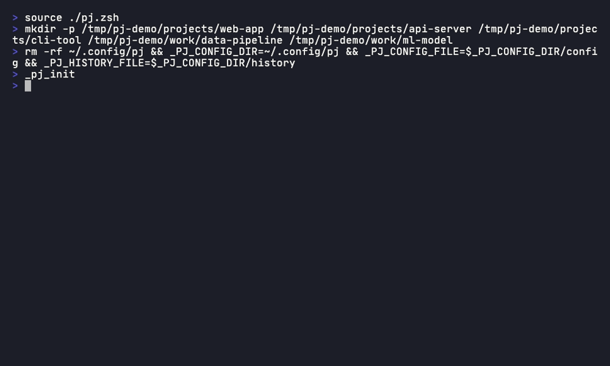

# pjfzf

A project directory navigator for zsh, powered by [fzf](https://github.com/junegunn/fzf). Quickly jump to your projects with frecency-based sorting.

[한국어](README.ko.md)



## Why pjfzf?

Unlike general-purpose directory jumpers (z, zoxide, autojump), pjfzf is designed specifically for **project directories**:

| | pjfzf | zoxide / z / autojump |
|---|---|---|
| **Scope** | Only registered project directories — no noise | Every directory you've ever visited |
| **Browsing** | fzf with file preview | Blind jump by query match |
| **Project creation** | `pjmk` creates and navigates | Not supported |
| **Tab completion** | `pj ` + Tab opens fzf | Standard shell completion |

## Installation

### Homebrew

```zsh
brew tap K021/pjfzf
brew install pjfzf
```

Then add to `~/.zshrc`:

```zsh
source $(brew --prefix)/share/pjfzf/pj.zsh
```

### Manual

```zsh
curl -o ~/.pj.zsh https://raw.githubusercontent.com/K021/pjfzf/main/pj.zsh
echo 'source ~/.pj.zsh' >> ~/.zshrc
source ~/.zshrc
```

### Requirements

- zsh
- [fzf](https://github.com/junegunn/fzf) (`brew install fzf`)

## Usage

```zsh
pj                  # Select project interactively with fzf
pj <query>          # Filter with initial search query
pj add <path>       # Register a base directory
pj remove <path>    # Unregister a base directory
pj list             # Show registered base directories
pj help             # Show help
```

### Create a project

```zsh
pjmk                # Pick base directory → enter name → create & cd
pjmk my-project     # Provide name upfront
```

### Tab completion

Type `pj ` and press Tab to launch fzf.

## Configuration

| File | Path |
|------|------|
| Config | `~/.config/pj/config` |
| History | `~/.config/pj/history` |

The config file lists base directories, one per line. Default: `~/projects`.

## License

MIT
